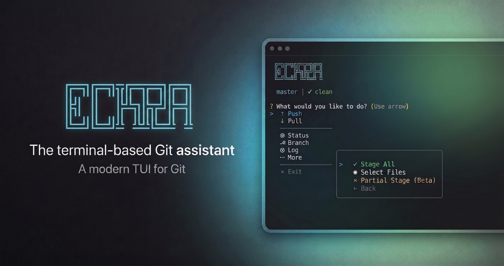

# Eckra

Eckra is a command-line interface (CLI) for Git repository management. It provides an interactive terminal interface for standard Git operations and integrates with Large Language Models (LLMs) to automate the generation of commit messages.

<p align="center">
  
</p>

## Overview

The tool is designed to streamline version control workflows by providing a structured interface for staging, committing, and branch management. It supports integration with local LLM providers such as LM Studio and Ollama, as well as cloud-based services including OpenAI and Anthropic.

## Core Features

- **Automated Commit Generation**: Uses git diff data to generate contextually relevant commit messages via configured AI providers.
- **Interactive Status Management**: Provides a visual interface for viewing repository status and staging changes.
- **Partial Staging**: Supports the selection of specific file hunks for staging.
- **Branch Management**: Tools for creating, deleting, and switching branches, including ahead/behind tracking.
- **Conflict Resolution**: Structured workflow for resolving merge conflicts.
- **History Visualization**: Renders commit history and branch graphs within the terminal.

## Installation

### Prerequisites

- Node.js (version 14.0.0 or higher)
- Git

### Setup from Source

1. Clone the repository:

   ```bash
   git clone https://github.com/sudoeren/eckra.git
   cd eckra
   ```

2. Install dependencies:

   ```bash
   npm install
   ```

3. Link the application globally:
   ```bash
   npm link
   ```

## Usage

Execute the primary command within a Git repository to launch the dashboard:

```bash
eckra
```

### Direct Commands

The tool also supports direct access to specific modules:

- `eckra status`: Open the status and staging interface.
- `eckra commit`: Initiate the AI-assisted commit flow.
- `eckra push`: Push changes to the remote repository.

## AI Integration

Eckra can be configured to use various AI backends for commit message generation.

| Provider  | Endpoint               | Use Case                               |
| :-------- | :--------------------- | :------------------------------------- |
| LM Studio | http://localhost:1234  | Local inference and privacy            |
| Ollama    | http://localhost:11434 | Local inference (Llama, Mistral, etc.) |
| OpenAI    | API                    | Cloud-based GPT models                 |
| Anthropic | API                    | Cloud-based Claude models              |

## Configuration

Configuration is managed through JSON files. The application follows a cascading priority:

1.  **Global Configuration**: Located at `~/.eckra/config.json`.
2.  **Local Configuration**: Defined in a `.eckrarc` file within the project root.

### Configuration Example

```json
{
  "aiProvider": "ollama",
  "ollamaModel": "llama3",
  "aiInstruction": "Ensure commit messages follow Conventional Commits specification."
}
```

## Development and Testing

The project uses Jest for unit testing. To execute the test suite:

```bash
npm test
```

## License

This project is licensed under the MIT License.
